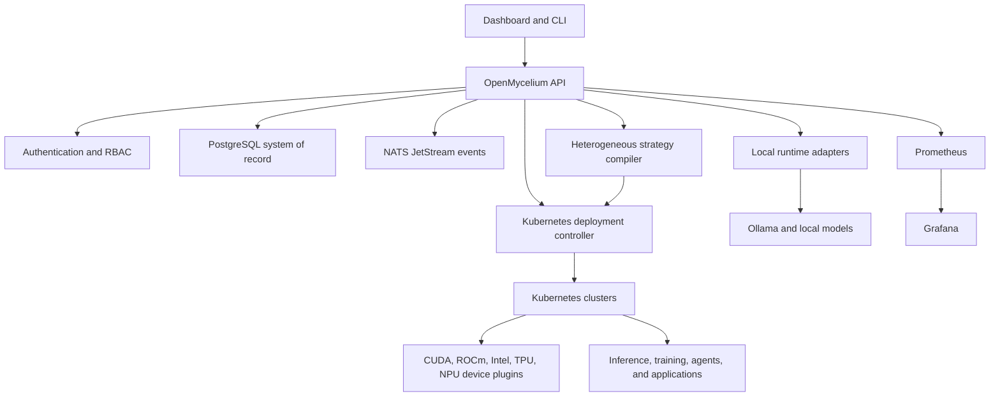

# OpenMycelium Architecture

## System overview

OpenMycelium separates governance from execution. The control plane records desired state, policy, identity, and lifecycle information. Existing runtimes and Kubernetes clusters execute workloads using their native drivers and schedulers.



## Control-plane components

### Go API service

The Go service embeds the dashboard and provides authenticated endpoints for:

- sessions, users, roles, settings, and audit records
- hosts, clusters, nodes, accelerator pools, queues, and quotas
- workspaces, manifests, workloads, lifecycle actions, and Kubernetes operations
- model repository, Ollama discovery, inference proxy, and model planning
- agent definitions, flows, tools, memory, approvals, runs, evaluations, and traces
- health, readiness, MLOps, AIOps, and Prometheus metrics

### PostgreSQL

PostgreSQL is the durable source of truth for identity, infrastructure inventory, policies, releases, workloads, models, orchestration records, and audit events. Docker volumes preserve local data across rebuilds and restarts.

### NATS JetStream

NATS transports durable control-plane and agent-run events. It is not the system of record; consumers can replay events while authoritative state remains in PostgreSQL.

### Kubernetes controller

The controller uses encrypted kubeconfigs to generate, apply, inspect, and reconcile resources. Depending on workload type it creates Deployments, Services, Jobs, indexed Jobs, persistent volume claims, service accounts, scheduling resources, and model caches.

### Local runtime adapters

The current local inference adapter connects to an existing Ollama service. OpenMycelium registers and governs the workload without duplicating the model files or falsely claiming a separate container was created.

### Observability

Prometheus scrapes authenticated platform metrics and evaluates alert rules. Grafana is provisioned with an OpenMycelium operations dashboard. Kubernetes events, pod states, restart counts, logs, and service probes remain available in the control-plane UI.

## Workspace model

```text
Organization
  -> Workspace
     -> Kubernetes cluster
     -> Namespace
     -> Quotas and queue
     -> StorageClass and model cache
     -> Registry credentials and network policy
     -> Releases
        -> Controllers, pods, services, storage, configuration, events
```

OpenMycelium labels managed resources with workspace, release, and management identity so live Kubernetes state can be reconciled with PostgreSQL release records.

## Scheduling model

Accelerator pools are logical placement policies over real inventory. A pool can select vendor resource names, node labels, memory classes, slicing profiles, and topology preferences. Workload admission validates aggregate CPU, RAM, and accelerator capacity before creating resources.

Supported scheduling contracts include:

- native Kubernetes scheduling
- exact extended-resource requests
- NVIDIA MIG and shared-GPU profiles
- indexed parallel Jobs
- Kueue admission
- Volcano gang scheduling
- PriorityClass
- compact or spread placement
- headless rendezvous Services
- RDMA and InfiniBand runtime requirements

The execution framework remains responsible for tensor, pipeline, data, expert, or stage parallelism inside the admitted resources.

### Heterogeneous strategy compiler

The fabric compiler joins persisted node capabilities, live available accelerator resources, and benchmark profiles. It groups devices by vendor/runtime/model, predicts relative capacity, allocates layers and microbatches, calculates model-state and ZeRO memory, chooses a communication path, and persists an immutable execution contract. Transport admission fails closed: mixed-vendor direct paths require both an advertised adapter and RDMA on every selected node. A Gloo CPU-forwarding path is available only when explicitly allowed.

Ready plans are attached to Celium AI+ workloads and injected into Kubernetes pods as serialized environment contracts. Multi-group training plans expand into one indexed Job per vendor group, each with its exact extended-resource request, inventory-derived node constraint, group size, and global rank base. The workload image remains responsible for adapting its framework runtime to that contract. This keeps control-plane scheduling distinct from data-plane tensor execution and avoids claiming cross-vendor coherent memory.

## Security model

- bcrypt password hashing
- revocable, HttpOnly server-side sessions
- role-based API authorization
- encrypted Kubernetes credentials
- separate metrics and agent bearer tokens
- audit records for administrative and workload actions
- non-root Helm security context
- read-only root filesystem and dropped capabilities
- optional network policy
- no secrets committed to the repository

Production deployments should add TLS, external identity, a KMS or secret manager, highly available data services, backup and restore automation, image signing, vulnerability scanning, and policy enforcement.

## Deployment modes

### Developer Edition Compose

The branded installer deploys OpenMycelium, PostgreSQL, NATS, Prometheus, and Grafana on Windows, macOS, or Linux. This is the most complete current installation path.

### Native binary

GoReleaser defines Windows, macOS, and Linux builds for AMD64 and ARM64. Native operation still requires reachable PostgreSQL and NATS services for full readiness.

### Kubernetes and Helm

The Helm chart deploys a hardened control-plane pod against external PostgreSQL and NATS. It is an evaluation foundation rather than a finished enterprise distribution. Production completion requires published multi-architecture images, a functional signed discovery agent, ingress and TLS, external secret integration, backups, HA validation, and upgrade testing.

## Repository map

| Path | Purpose |
| --- | --- |
| `main.go` | API server, local runtime integration, and embedded UI |
| `kubernetes.go` | Kubernetes deployment, scheduling, and lifecycle operations |
| `resources.go` | persistent infrastructure and governance resources |
| `workspaces.go` | workspace inventory and application gateway |
| `agents.go` | agentic orchestration resources and events |
| `models.go` | governed model catalog |
| `operations.go` | MLOps and AIOps summaries and metrics |
| `app.js`, `index.html`, `premium.css` | control-plane dashboard |
| `install.ps1`, `install.sh` | branded local lifecycle installers |
| `deploy/helm/openmycelium` | Kubernetes Helm chart |
| `observability` | Prometheus rules and Grafana provisioning |
| `agents` | discovery and reference agent runtime assets |
