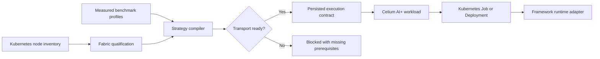

# Heterogeneous execution fabric

OpenMycelium turns heterogeneous accelerator research into a production-shaped control-plane workflow without claiming impossible cross-vendor hardware coherence.

## What is implemented

1. **Capability inventory** records native collective backends, RDMA resources, GPUDirect, AMD DirectGMA, and optional transport-adapter labels for each Kubernetes node.
2. **Qualification admission** shows whether a node is ready and schedulable, which communication paths are advertised, and which claims still need benchmark evidence.
3. **Benchmark profiles** persist model, precision, throughput, memory, P2P, and all-reduce measurements in PostgreSQL. Profiles retain their source as measured, operator supplied, or imported.
4. **Mycelium optimization** groups live available accelerators by vendor, runtime, model, and Kubernetes resource. It uses measured throughput and memory to minimize predicted stage time, evaluates admissible parallel candidates, and emits an explainable score and decision trace.
5. **Parallel contracts** describe pipeline, tensor, data, expert, and ZeRO dimensions plus a selected communication transport.
6. **Fail-closed transport selection** allows native NCCL, RCCL, or oneCCL within a vendor. Mixed-vendor direct execution requires both an advertised adapter and RDMA on every selected node. An explicit Gloo fallback stages data through host memory.
7. **Kubernetes delivery** expands training, fine-tuning, and batch plans into one indexed Job per accelerator group. Each Job requests its exact vendor extended resource, retains qualified-node constraints, and receives a non-overlapping rank base. Blocked plans cannot be deployed.
   CUDA, ROCm, and oneAPI groups may use separate worker images from the same plan.
8. **Operations** expose qualification, profiles, plans, placement estimates, CLI parity, audit events, NATS events, and bounded-label Prometheus metrics.

## Execution flow



## Node qualification labels

OpenMycelium consumes existing node labels; it does not install or impersonate the corresponding driver:

```text
openmycelium.io/rdma=ready
openmycelium.io/gpudirect=ready
openmycelium.io/directgma=ready
openmycelium.io/hetccl=enabled
openmycelium.io/device-direct=enabled
```

RDMA extended resources containing `rdma/` or `infiniband` are also discovered. Native `nvidia.com/gpu`, `amd.com/gpu`, and Intel resources continue to determine physical accelerator capacity.

## CLI workflow

```powershell
python .\openmycelium.py fabric qualification --cluster CLUSTER_ID

python .\openmycelium.py fabric profile-add a100-gemma `
  --cluster CLUSTER_ID --vendor nvidia --runtime cuda --model "A100 80GB" `
  --precision bf16 --tokens-per-second 310 --memory-gib 80 --source measured

python .\openmycelium.py fabric execution-plan mixed-train `
  --cluster CLUSTER_ID --model custom-12b --parameters-b 12 --layers 48 `
  --global-batch 16 --kind training --zero-stage 2 --transport auto `
  --allow-cpu-fallback --dynamic-microbatch --default-memory-gib 24

python .\openmycelium.py workload submit mixed-train-run `
  --kind training --cluster CLUSTER_ID --image REGISTRY/trainer:TAG `
  --execution-plan EXECUTION_PLAN_ID --replicas 4 --cpu 8 --memory 64Gi
```

## Runtime contract

Managed pods receive:

```text
OPENMYCELIUM_EXECUTION_PLAN_ID
OPENMYCELIUM_EXECUTION_TRANSPORT
OPENMYCELIUM_EXECUTION_PLAN_JSON
```

The application image must contain a framework adapter that reads the contract and configures PyTorch, DeepSpeed, Megatron, Ray, MPI, or another runtime. OpenMycelium currently supplies the control-plane contract and Kubernetes placement; it does not rewrite arbitrary training code.

For PyTorch correctness testing, `runtime/mycelium` supplies a Gloo CPU-forwarded reference adapter and launcher. See [Mycelium algorithm](MYCELIUM_ALGORITHM.md) for its optimizer and runtime contracts.

For a multi-group plan, the controller also injects `OPENMYCELIUM_EXECUTION_GROUP_ID`, `OPENMYCELIUM_EXECUTION_GROUP_SIZE`, `OPENMYCELIUM_RANK_BASE`, `OPENMYCELIUM_WORLD_SIZE`, and the indexed Job completion index. All group Jobs share the workload label and rendezvous Service, so lifecycle reconciliation, pod inspection, logs, deletion, and generated manifests remain one OpenMycelium workload.

Multi-group inference plans remain rejected by the Kubernetes controller until the HetCCL 0.2 inference adapters are connected to model-specific worker codecs and release reconciliation. A generic serving container cannot be safely split across vendor groups merely by adding environment variables.

## Research-inspired scope

- **HetHub-style capability**: model-aware profiling and heterogeneous layer/microbatch allocation.
- **HetCCL-style capability**: a transport-adapter boundary for cross-vendor collectives, with strict prerequisite checks.
- **Joint AMD-NVIDIA training**: explicit mixed CUDA/ROCm planning, pipeline-oriented fallback, and device-specific profile weighting.

The public papers inform this architecture. Their results are not represented as bundled production runtimes or reproduced benchmark claims.

## Hard boundary

OpenMycelium coordinates separate memory domains. It does not make NVIDIA VRAM, AMD VRAM, host RAM, Apple unified memory, cloud GPU memory, or TPU HBM pointer-coherent. Network transport, serialization, framework support, and synchronization cost remain real.
