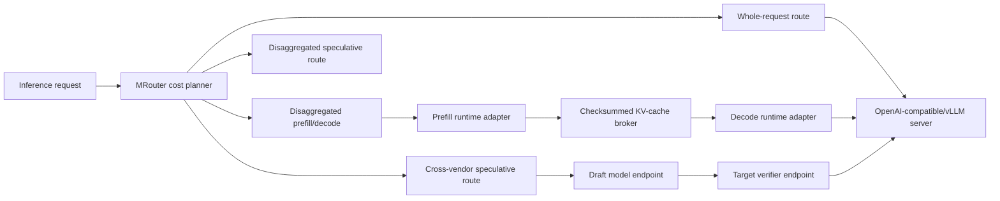

# Heterogeneous inference fabric

OpenMycelium MCCL 0.2.0 adds a correctness-first reference path for routing
inference stages across CUDA, ROCm, Metal, oneAPI, and CPU endpoints. It does
not claim coherent cross-vendor VRAM. Each runtime converts its native state to
a canonical transfer representation at an explicit boundary.

## Architecture



## MRouter

MRouter evaluates four modes:

1. `whole-request` keeps model state and KV cache on one node.
2. `disaggregated-prefill-decode` transfers a canonical KV cache once.
3. `cross-vendor-speculative` transfers token IDs and probability rows while
   the target model remains the correctness authority.
4. `disaggregated-speculative` combines a dedicated prefill node, a draft
   endpoint, and a separate target verifier. The KV cache moves once from the
   prefill node to the target; draft traffic remains token-level.

For each candidate route, the reference score is:

```text
score = compute_ms + queue_ms + transfer_ms
      + hourly_cost * cost_weight_ms_per_dollar_hour
```

Transfer time uses the slower endpoint bandwidth and both endpoint latency
terms. Only healthy nodes with enough model memory are considered. Production
profiles must come from measured throughput and network telemetry rather than
vendor-name assumptions.

Run a plan from two JSON files:

```bash
mccl inference-plan --nodes nodes.json --request request.json
```

## KV-cache transfer

`KVCacheDescriptor` defines a versioned canonical cache:

```text
layout: kv-layer-batch-head-sequence-dim
shape:  (2, layers, batch, heads, sequence, head_dim)
```

The source adapter converts its native cache to contiguous bytes. The broker
validates dtype, shape, exact byte length, SHA-256 checksum, capacity, TTL, and
optional shared-token authentication. The destination verifies the checksum
again before reconstructing its native cache.

Start the reference broker:

```bash
mccl kv-serve --host 0.0.0.0 --port 29600 --max-mib 1024 --ttl 300
```

Set `MCCL_KV_AUTH_TOKEN` on the broker and clients when shared-token
authentication is required. Production deployments must place this protocol
behind TLS or mTLS because the portable TCP reference does not encrypt frames.

The Python API uses `KVCacheClient.put()`, `get()`, and `delete()`. TLS,
persistent object storage, per-tenant encryption keys, paged-cache streaming,
and zero-copy RDMA are production follow-on requirements.

## Metal adapter

`MetalAdapter` supports PyTorch MPS tensor synchronization and lossless staging
through canonical host bytes. It detects MLX but does not serialize private MLX
cache objects; each MLX model integration must provide a stable codec. On a
non-Mac host, byte staging remains testable while Metal execution is reported
as unavailable.

## vLLM adapter

`OpenAICompatibleAdapter` and `VLLMServingAdapter` use the standard
`/v1/models`, `/v1/completions`, and `/v1/chat/completions` interfaces for
ordinary inference. Check an endpoint with:

```bash
mccl vllm-check --url http://worker:8000 --model model-name --runtime cuda
```

The command reads an API key from `OPENAI_API_KEY` by default. Use
`--api-key-env VARIABLE_NAME` to select another environment variable without
placing a secret in the process list.

Cross-vendor speculative decoding additionally requires an OpenMycelium worker
extension exposing:

- `GET /v1/mccl/capabilities`
- `POST /v1/mccl/propose`
- `POST /v1/mccl/verify`

A stock vLLM OpenAI server is therefore usable for normal inference but is not
reported as speculative-capable unless those token-probability endpoints exist.

## Speculative decoding

The draft endpoint returns candidate tokens and normalized draft probability
distributions. The target returns one normalized distribution for every draft
position plus one bonus position. Candidate `x_i` is accepted with:

```text
acceptance(x_i) = min(1, p_target(x_i) / p_draft(x_i))
```

On rejection, the replacement token is sampled from:

```text
normalize(max(p_target - p_draft, 0))
```

If every draft token is accepted, one bonus token is sampled from the target.
With complete normalized distributions this preserves the target distribution.
Top-k-only approximations must be separately qualified because they can change
the output distribution.

## Current qualification boundary

The broker, router, HTTP adapters, Metal host staging, and speculative sampling
logic have deterministic CPU tests. Production qualification still requires:

- model-specific vLLM paged-KV extraction and restoration plugins
- MLX/Metal model cache codecs on Apple hardware
- real CUDA-to-ROCm and Metal-to-CUDA endpoint tests
- streaming/chunked cache transfer, TLS/mTLS, authorization, and encryption
- failure recovery, cancellation, backpressure, metrics, and distributed traces
- numerical parity and performance benchmarks on supported hardware

Until those tests pass, OpenMycelium must label these paths as reference or
unqualified rather than production device-direct execution.
