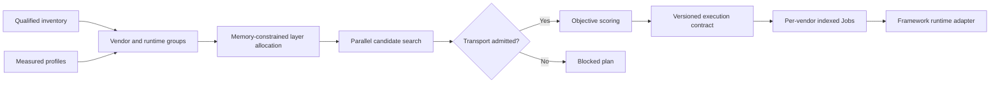

# Mycelium algorithm

**Mycelium** is OpenMycelium's versioned, explainable heterogeneous execution
optimizer. It converts live accelerator inventory, measured profiles, model
requirements, memory limits, and admitted communication transports into a
reproducible distributed execution contract.

It is an OpenMycelium implementation. The name does not imply authorship of,
or benchmark equivalence with, the research systems that informed the product
direction.

## Optimization pipeline



## Inputs

- Ready, schedulable nodes and allocatable extended resources
- CUDA, ROCm, oneAPI, NCCL, RCCL, oneCCL, RDMA and adapter qualification
- Model parameters, transformer layers, precision, sequence length and batch
- Measured throughput, layer latency, memory, P2P, all-reduce and power
- Transport policy, maximum devices, pipeline limit, ZeRO stage and objective
- Optional per-vendor CUDA, ROCm, and oneAPI worker images

## Placement algorithm

Mycelium groups accelerators by vendor, runtime, model and Kubernetes resource.
Each group receives a capacity weight:

```text
group capacity = measured throughput per device * available devices
```

Transformer layers are assigned one at a time to the group with the lowest
projected stage time while the group's profiled aggregate memory can hold the
assigned model state:

```text
projected stage time = (assigned layers + 1) / group capacity
```

This greedy minimax step is deterministic and minimizes the predicted slowest
pipeline stage. If no measured memory placement is feasible, the plan records
the failure and recommends ZeRO, checkpointing, offload, or more devices.

## Candidate search

The first release evaluates admissible data, pipeline and ZeRO contracts.
Host-forwarded mixed-vendor plans remain pipeline-oriented. A qualified
MCCL or device-direct adapter permits collective data/ZeRO candidates. The
selected candidate maximizes one of:

- `throughput`: predicted tokens per second after transport and imbalance cost
- `balanced`: throughput with a stronger slow-stage penalty
- `efficiency`: predicted throughput per measured watt

Every plan stores the algorithm name and version, candidates evaluated,
selected contract, score, profile coverage, stage imbalance, memory
feasibility, and a human-readable decision trace.

Because CUDA and ROCm PyTorch distributions are normally packaged separately,
an execution plan can assign a different OCI image to each vendor group. The
Kubernetes controller applies the override while retaining one global rank
space, rendezvous service, workload identity, lifecycle, and checkpoint path.

## Runtime contract

Pods receive the serialized plan plus:

```text
OPENMYCELIUM_ALGORITHM=Mycelium
OPENMYCELIUM_ALGORITHM_VERSION=1.0.0
OPENMYCELIUM_OPTIMIZATION_OBJECTIVE
OPENMYCELIUM_EXECUTION_PLAN_ID
OPENMYCELIUM_EXECUTION_TRANSPORT
OPENMYCELIUM_EXECUTION_GROUP_ID
OPENMYCELIUM_EXECUTION_GROUP_SIZE
OPENMYCELIUM_RANK_BASE
OPENMYCELIUM_WORKER_INDEX
OPENMYCELIUM_WORLD_SIZE
```

`runtime/mycelium` is a functional PyTorch reference adapter for Gloo
CPU-forwarded all-reduce. It stages accelerator tensors in pinned host memory,
uses a common CPU collective, and copies the result back. CUDA and ROCm worker
images can therefore participate in one correctness-oriented baseline.

`runtime/mccl` adds an installable `mccl-tcp` transport with a typed,
sequence-safe TCP coordinator and a PyTorch host-staging bridge. This transport
is executable without RDMA and is separately named so it cannot be confused
with the optimized device-direct MCCL path.

## Transport boundary

Mycelium does not create coherent memory across unrelated accelerators.
`mccl` and `device-direct` are direct native plug-in contracts and stay blocked
unless every selected node advertises the adapter and a qualified RDMA path.
Paper-level direct-transfer performance requires a separately built and
hardware-validated C++/CUDA/HIP/RDMA collective library.

## Production qualification

Before enabling a direct adapter, operators must validate loss and gradient
parity, BF16/FP16/FP32 reductions, collective correctness, timeouts, restart
behavior, checkpoint recovery, multi-NIC scaling, and homogeneous baselines on
the exact Linux kernel, driver, NIC, firmware, CUDA, ROCm, NCCL and RCCL matrix.
