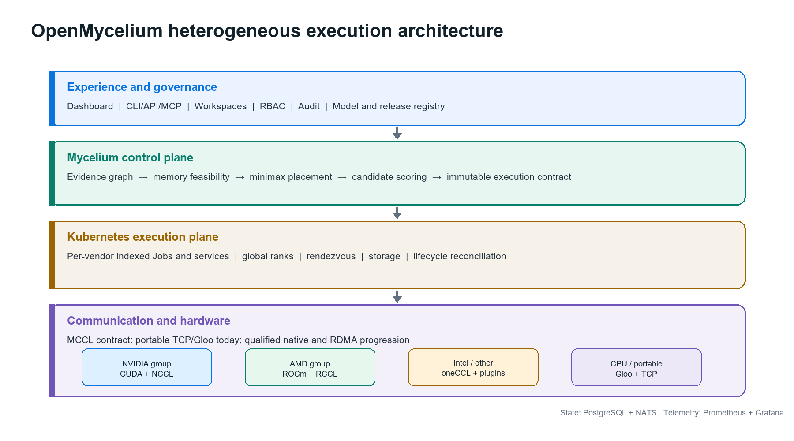
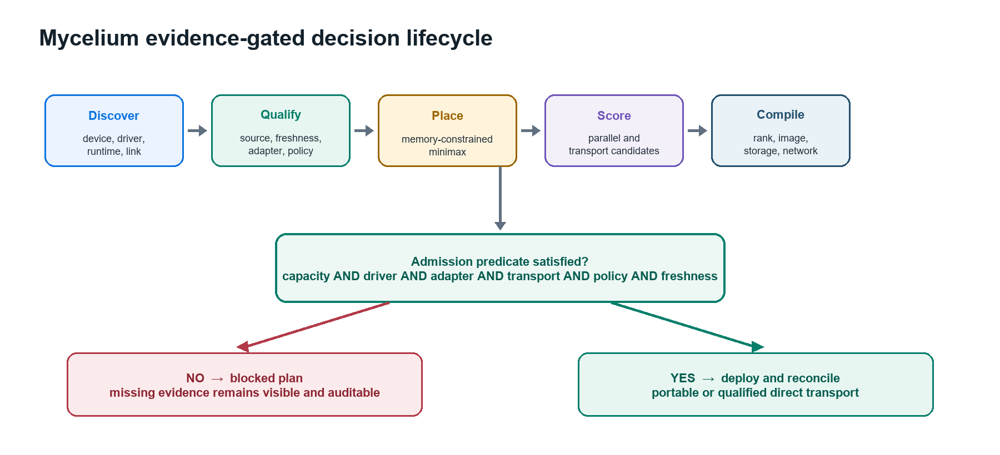

# OpenMycelium: Evidence-Gated Heterogeneous AI Placement and Collective Execution Across Vendor-Specific Accelerators

**Technical manuscript and invention disclosure, Version 1.0**

**OpenMycelium Project**
**22 August 2026**

> Publication status: engineering preprint. Author names, affiliations, funding disclosures, and the target venue template must be finalized before submission. The patent-oriented material in Appendix A is an engineering invention disclosure, not legal advice. If patent protection is desired, qualified counsel should review and file before any additional public disclosure.

## Abstract

AI infrastructure is commonly operated through vendor-specific device drivers, collective libraries, container images, schedulers, and observability systems. This fragmentation becomes a capacity and cost problem when an organization owns NVIDIA, AMD, Intel, Apple, CPU, and cloud resources that cannot participate in one operational workflow. Existing systems address important subsets of the problem: Kubernetes allocates devices; vendor operators provision one ecosystem; native collective libraries optimize one device family; and recent research demonstrates mixed-vendor training and communication. What remains operationally difficult is joining discovery evidence, model-memory feasibility, explainable heterogeneous placement, vendor-specific runtime packaging, communication qualification, Kubernetes lifecycle, and enterprise governance into one reproducible execution contract.

This paper presents OpenMycelium and its Mycelium 1.0 algorithm. Mycelium models the infrastructure as a capability-and-link graph, filters capacity through evidence gates, groups compatible devices, performs memory-constrained minimax layer allocation, distributes microbatches by measured capacity, evaluates data, pipeline, and ZeRO candidates, and selects an objective-specific plan. The resulting immutable contract assigns vendor-specific OCI images while preserving one workload identity, global rank space, rendezvous, lifecycle, and audit record. MCCL 0.1 provides a typed, sequence-safe, host-staged TCP AllReduce reference path; optimized direct MCCL remains blocked until every selected node supplies qualified RDMA and device-memory evidence. The current implementation therefore demonstrates control-plane integration and portable collective correctness without claiming coherent cross-vendor memory or unmeasured GPU performance. The primary contribution is an evidence-gated coupling of scheduling and communication: a plan is executable only when the complete device, runtime, transport, and policy chain is supported by current evidence.

**Index Terms:** heterogeneous accelerators, GPU scheduling, distributed training, collective communication, Kubernetes, RDMA, model placement, MLOps, vendor-neutral AI infrastructure.

## I. Introduction

Organizations rarely replace an accelerator estate in one step. New NVIDIA systems may coexist with older CUDA nodes, AMD ROCm clusters, Intel accelerators, Apple development machines, CPU servers, and rented cloud capacity. These devices do not expose one hardware-coherent memory pool. Their drivers, binary formats, collective libraries, memory semantics, and container images remain distinct. A practical vendor-neutral platform must therefore coordinate separate memory domains and execution runtimes instead of describing them as physically unified memory.

Recent work establishes that mixed-vendor training is technically possible. HETHUB combines a unified communicator, performance predictor, and automatic parallel planner for heterogeneous large-model training [1]. Joint Training on AMD and NVIDIA GPUs studies CPU-forwarded and device-direct communication and reports up to 98% of an NVIDIA homogeneous baseline for the evaluated configuration [2]. HetCCL combines vendor-local NCCL and RCCL with RDMA-based cross-vendor communication without driver changes [3]. These systems demonstrate the data-plane opportunity. They do not, by themselves, provide an enterprise control plane that continuously verifies infrastructure evidence, compiles a placement decision into Kubernetes resources, binds the decision to identity and policy, and reconciles the resulting workload.

OpenMycelium addresses that operational gap. It is not a replacement for CUDA, ROCm, NCCL, RCCL, oneCCL, Kubernetes, or framework runtimes. It is a control and execution plane above them. Its Mycelium algorithm converts qualified inventory, model requirements, measured profiles, topology, policy, and runtime availability into an explainable plan. Its execution controller renders per-vendor Kubernetes Jobs or services, and its MCCL contract selects either a portable correctness path or a qualified native path.

The paper makes five implementation-grounded contributions:

1. An evidence-gated capability graph that distinguishes detected, advertised, measured, qualified, simulated, and stale evidence.
2. A memory-constrained greedy minimax allocator with explainable candidate scoring for throughput, balance, or efficiency.
3. A multi-image execution contract that allows CUDA, ROCm, and oneAPI workers to retain vendor-native packaging while sharing one global workload and rank model.
4. A fail-closed communication progression from Gloo or typed TCP host staging to native and RDMA paths only after qualification.
5. A lifecycle integration that persists decisions, emits Kubernetes resources, exposes diagnostics, and retains audit and observability metadata.

## II. Market Gap and Prior Art

### A. Fragmented product categories

Kubernetes Dynamic Resource Allocation defines ResourceSlices, DeviceClasses, and ResourceClaims so the scheduler can allocate devices and associated capacity [4]. The NVIDIA GPU Operator automates NVIDIA drivers, CUDA enablement, device plugins, labeling, and monitoring [5]. RCCL provides AMD-optimized multi-GPU and multi-node collectives [6], while oneCCL defines operations between homogeneous oneCCL device objects [7]. These are valuable building blocks, but each solves a narrower layer than end-to-end mixed-vendor AI execution.

The market gap is not the absence of schedulers, collectives, or model runtimes. It is the absence, in the reviewed public systems, of one open operational contract combining all of the following:

| Capability | Established category | Residual gap addressed by OpenMycelium |
|---|---|---|
| Device allocation | Kubernetes DRA, device plugins | Model-aware cross-vendor grouping, evidence quality, and execution admission |
| Vendor provisioning | NVIDIA GPU Operator and vendor equivalents | One governance plane across multiple vendor operators and runtimes |
| Native collectives | NCCL, RCCL, oneCCL | One ranked workload spanning vendor-specific native groups |
| Heterogeneous research | HETHUB, Joint Training, HetCCL | Product lifecycle, Kubernetes rendering, RBAC, audit, model/workspace context, and truthful qualification states |
| MLOps platforms | Training, serving, registry, pipelines | Accelerator portability and transport-aware placement as a first-class contract |

This gap statement is a reasoned inference from the cited public sources, not an exhaustive commercial or patent landscape search. The field is active. For example, CN121277873A describes topology-aware minimum-cost collective scheduling for heterogeneous GPU clusters [8]. Any patent filing must therefore distinguish the coupled control-plane mechanisms described in Appendix A from topology optimization or heterogeneous communication considered alone.

### B. Design position

OpenMycelium treats heterogeneity as a constrained graph scheduling problem. It does not attempt to make unrelated VRAM address spaces coherent. Logical pooling means that the scheduler can discover, compare, reserve, partition, and coordinate devices under one policy. Data still moves through an explicit communication path whose feasibility and cost are represented in the plan.

## III. System Model

Let the execution fabric be a directed attributed graph:

$$G = (V, E), with V formed by the device set D, host set H, and runtime-adapter set R.$$

where D is the set of accelerator or CPU devices, H is the set of hosts, and R is the set of runtime adapters. A device d_i carries the attribute vector

$$a_i = (vendor_i, runtime_i, memory_i, throughput_i, power_i, qualification_i, timestamp_i).$$

where v_i is vendor, r_i is runtime, m_i is usable memory, s_i is measured or conservative throughput, p_i is power, q_i is qualification state, and tau_i is evidence timestamp. A directed communication edge e_ij carries latency alpha_ij, bandwidth beta_ij, staging/conversion cost kappa_ij, and qualification q_ij.

The predicted cost of transferring a message of size x is

$$c_ij(x) = latency_ij + x / bandwidth_ij + staging_cost_ij(x).  (1)$$

The evidence gate excludes a node or edge when required measurements are absent, stale, simulated, or incompatible with policy. A simulated Mycelium Lab profile can be used to compare plans but cannot satisfy production admission.

### A. Model memory

For a model with P parameters and per-parameter bytes b_w, the inference weight memory is

$$M_weights = P × b_w.  (2)$$

For training, the implementation estimates weights, gradients, and optimizer state. A generalized per-rank approximation is

$$M_train,i = P(b_w + b_g + b_o) / z_i + M_act,i + M_temp,i + M_ckpt,i.  (3)$$

where z_i represents the effective ZeRO or sharding factor for the state component, and activation, temporary, and checkpoint buffers are explicit additions. The current estimator uses precision-specific weight bytes and conservative mixed-precision Adam terms before ZeRO sharding.

For transformer inference, the key-value cache approximation is

$$M_KV = 2 × L × B × S × H_kv × d_h × b_kv.  (4)$$

where L is layer count, B is concurrent batch, S is cached sequence length, H_kv is the number of key-value heads, d_h is head dimension, and b_kv is bytes per KV element. For a mixture-of-experts model, memory feasibility uses total stored parameters while compute estimates use active parameters P_active.

Useful first-order compute estimates are

$$F_infer/token ≈ 2 × P_active;     F_train/step ≈ 6 × P_active × B × S.  (5)$$

These formulas are planning approximations, not substitutes for measured model/runtime profiles.

## IV. Mycelium 1.0 Placement Algorithm

### A. Compatible execution groups

Ready devices are grouped by vendor, runtime, model, and Kubernetes resource name. Group i has n_i devices, per-device usable memory m_i, throughput weight s_i, and optional measured power p_i. This grouping prevents a CUDA image from being scheduled as if it were a ROCm image while still allowing both groups to participate in one global plan.

### B. Memory-constrained minimax layer assignment

For a transformer with L layers, let l_i be the layers assigned to group i. The continuous target is

$$minimize over l_1...l_K:  max_i [ l_i / (s_i × n_i) ]$$

$$subject to sum_i(l_i) = L, l_i ≥ 0, and l_i × mean_memory_layer ≤ n_i × m_i.  (6)$$

Mycelium implements a deterministic greedy approximation. It assigns each next layer to the feasible group with the smallest projected stage time:

$$i* = arg min_i [ (l_i + 1) / (s_i × n_i) ].  (7)$$

If no group remains memory-feasible, allocation continues only to produce a diagnostic plan; the plan is marked memory-infeasible and recommends a higher ZeRO stage, activation checkpointing, offload, more memory, or additional devices.

The resulting stage imbalance is

$$I = (max_i t_i - min_i t_i) / max_i t_i, where t_i = l_i / (s_i × n_i).  (8)$$

### C. Dynamic microbatch distribution

For global microbatch B, Mycelium uses capacity-proportional integer allocation:

$$estimated b_i = B(s_i × n_i) / sum_j(s_j × n_j), with sum_i(b_i) = B and integer b_i ≥ 0.  (9)$$

Remainders are distributed deterministically. Operators can disable dynamic allocation, in which case groups receive uniform weights before integer distribution.

### D. Parallel candidate search and scoring

Candidate contracts include data parallel, pipeline parallel, and ZeRO variants. Mixed-vendor host-forwarded plans remain pipeline-oriented unless an admitted MCCL transport permits heterogeneous data or ZeRO candidates. For candidate c, the implementation computes

$$J_c = aggregate_throughput × (1 - transport_penalty_c) × (1 - imbalance_weight_c × I).  (10)$$

where Theta is the measured aggregate throughput of covered profiles, rho_c is a transport penalty, and lambda_c is the imbalance weight. For the balanced objective, the imbalance penalty is increased. For efficiency,

$$J_eff,c = 1000 × J_c / sum_i(n_i × p_i).  (11)$$

The numeric transport penalties in Mycelium 1.0 are conservative policy coefficients, not universal hardware constants: heterogeneous Gloo 0.35, `mccl-tcp` 0.32, device-direct 0.12, direct `mccl` 0.10, and unknown 0.40. They are replaceable by measured topology profiles as qualification matures.

### E. Algorithm 1: plan compilation

```text
INPUT: workload W, inventory V, profiles P, policy Q
1. Filter V to ready and schedulable devices with current evidence.
2. Group devices by vendor, runtime, model, and resource identifier.
3. Match the best profile by group, model, precision, and evidence source.
4. Estimate model state, KV cache, activations, and per-layer memory.
5. Allocate layers using the greedy minimax rule in (7).
6. Allocate integer microbatches using (9).
7. Admit a communication transport using Algorithm 2.
8. Enumerate legal data, pipeline, expert, tensor, and ZeRO contracts.
9. Score candidates with (10) or (11); select the maximum.
10. Persist plan inputs, evidence, algorithm version, score, warnings, and decision trace.
11. Render per-vendor Kubernetes groups under one global rank contract.
OUTPUT: executable or blocked immutable execution contract C.
```

## V. Evidence-Gated Communication and MCCL

### A. Admission predicate

A direct cross-vendor plan is admitted only when every selected node has the required device runtime, native adapter, and qualified RDMA/device-memory path. Conceptually,

$$A(C) = capacity AND driver AND adapter AND transport AND policy AND evidence_freshness.  (12)$$

When `requireRdma=true`, neither Gloo nor `mccl-tcp` can satisfy the predicate. This prevents a hardware detection result from being misrepresented as a validated data path.

### B. Portable MCCL 0.1

MCCL 0.1 implements a centralized host-staged AllReduce for qualification and functional use. For rank tensors x_0 through x_{N-1} and reduction operator op, the correctness contract is

$$y_r = reduce_op(x_0, x_1, ..., x_N-1) for every rank r from 0 through N-1.  (13)$$

Each operation is keyed by `(group, sequence)`. The coordinator rejects duplicate ranks, inconsistent world size, dtype, element count, or operator metadata; waits for all ranks; reduces in rank order; delivers the same typed result to every rank; and removes state after all deliveries. Supported reference types are float32, float64, int32, and int64, with sum, average, minimum, and maximum operations.

The approximate centralized path time is

$$T_tcp(x) ≈ max_i[x / upload_bandwidth_i] + T_reduce(Nx) + max_i[x / download_bandwidth_i] + coordinator_latency.  (14)$$

This is intentionally a correctness baseline, not a performance claim.

### C. Native progression

For homogeneous ranks, a ring AllReduce lower-order model is

$$T_ring(x) ≈ 2(N - 1)latency + 2((N - 1) / N)(x / effective_bandwidth).  (15)$$

The planned native heterogeneous path is hierarchical:

$$T_hier(x) = T_native_reduce_scatter + T_cross_vendor_RDMA + T_native_all_gather.  (16)$$

NVIDIA-local ranks use NCCL, AMD-local ranks use RCCL, and other supported groups use their qualified native backend. Cross-group chunks use RDMA only after queue-pair, memory-registration, peer-memory, firmware, and failure-path qualification. The current source tree contains the C ABI and build-gated host/CUDA/ROCm adapter implementations; dynamic plugin loading, libibverbs transport, framework ProcessGroup registration, resiliency, and physical mixed-vendor benchmarks remain future work.

### D. Algorithm 2: transport selection

```text
INPUT: selected groups G, node evidence E, requested transport R
1. If R is device-direct or direct MCCL:
   a. Require adapter evidence on every selected node.
   b. Require qualified RDMA and device-memory registration on every node.
   c. Otherwise return BLOCKED with the missing evidence list.
2. If R is mccl-tcp:
   a. Reject when policy requires RDMA.
   b. Otherwise admit host-staged typed TCP and disclose central reduction.
3. If R is Gloo or CPU forwarding:
   a. Reject when policy requires RDMA.
   b. Otherwise admit the correctness-oriented CPU path.
4. Persist the selected path, evidence identifiers, warnings, and freshness.
```

## VI. Architecture and Execution Lifecycle



**Fig. 1.** OpenMycelium separates enterprise control-plane state, Mycelium plan compilation, Kubernetes execution, and MCCL/native communication. Vendor-specific runtime images are retained inside one global execution contract.

The control plane uses PostgreSQL as the system of record and NATS for durable operational events. Prometheus and Grafana provide platform telemetry. RBAC, workspace boundaries, quotas, audit records, and cluster credentials constrain the deployment controller. An execution plan is serialized into environment variables and labels, including algorithm version, plan identifier, group identifier, rank base, worker index, world size, and transport.



**Fig. 2.** The lifecycle is deliberately fail-closed. Missing evidence produces a blocked but inspectable plan rather than an optimistic deployment.

Vendor-specific groups are rendered as indexed Kubernetes Jobs or services with distinct OCI images, resource requests, node selectors, rendezvous configuration, storage, and network settings. The controller preserves one workload identity and reconciles pods, services, endpoints, logs, events, restarts, and generated manifests. This mechanism lets an enterprise use a CUDA training image and a ROCm training image without requiring one impossible universal binary.

## VII. Implemented Breakthrough and Its Boundary

The important engineering breakthrough in the current OpenMycelium code is the **evidence-gated execution contract**. Placement and communication are not independent dashboards. The optimizer's decision is carried into runtime identity, per-vendor images, ranks, Kubernetes resources, and transport admission. A direct plan cannot become executable merely because GPUs were detected. Conversely, the portable path has a separate name, `mccl-tcp`, so correctness evidence cannot be confused with device-direct performance.

This is a product-system breakthrough, not a claim that OpenMycelium invented heterogeneous training, collective communication, pipeline parallelism, or RDMA. The cited research and patents establish substantial prior art. The potentially differentiating combination is:

1. Evidence quality and freshness are part of the execution predicate.
2. The same plan joins memory feasibility, measured performance, parallel strategy, vendor image selection, rank assignment, and transport qualification.
3. Simulated evidence supports design-space exploration but is cryptographically and operationally isolated from production admission.
4. Every decision remains explainable and versioned rather than hidden inside an opaque scheduler score.
5. The system progresses from portable correctness to native acceleration without changing the control-plane workload model.

The current validation boundary is equally important. CPU-based automated tests verify Mycelium selection behavior, fail-closed admission, environment propagation, two-rank typed AllReduce correctness, and protocol mismatch handling. The project has not yet produced physical NVIDIA-AMD throughput, scaling, power, or fault-recovery results. It therefore makes no benchmark-equivalence claim with HETHUB, Joint Training, or the research HetCCL implementation.

## VIII. Business Use Cases

### A. Brownfield accelerator consolidation

Enterprises can bring partially utilized NVIDIA, AMD, Intel, and CPU capacity under one inventory and policy plane. Mycelium identifies workloads that can use separate vendor groups and those that must remain on a homogeneous pool. The business result is higher usable capacity without pretending all devices are interchangeable.

### B. Sovereign and regulated AI

Governments, healthcare, banking, defense, telecom, and industrial operators can keep models, datasets, checkpoints, and audit records on controlled infrastructure. Workspace, RBAC, policy, image, model, and transport evidence can be attached to each release.

### C. Hybrid-cloud capacity brokerage

A local cluster and rented GPU capacity can be compared through cost, throughput, memory, data-residency, and communication constraints. They remain separate memory domains. Suitable jobs can be scheduled, replicated, checkpointed, or migrated according to explicit policy.

### D. AI factories and internal platforms

Platform teams can offer a self-service workspace for inference, fine-tuning, distributed training, agentic AI, custom containers, YAML, and Helm. A release record unifies pods, services, endpoints, logs, terminal access, storage, configuration, policy, model lineage, and cost.

### E. Research and procurement

Mycelium Lab allows teams to evaluate proposed hardware mixes before purchase. Because simulated profiles cannot satisfy production gates, procurement experiments remain useful without contaminating operational inventory.

### F. Sustainability and capacity planning

The efficiency objective incorporates measured throughput and watts. With richer telemetry, organizations can optimize tokens per joule, carbon-aware placement, thermal headroom, and cloud price while preserving minimum service levels.

## IX. Commercial Evolution

OpenMycelium can evolve into a vendor-neutral AI infrastructure product through five milestones:

1. **Portable foundation:** production hardening of identity, workspaces, Kubernetes lifecycle, model registry, portable MCCL, backups, and upgrade safety.
2. **Native heterogeneous runtime:** dynamic C/C++ adapter loading, version negotiation, NCCL/RCCL local collectives, chunked cross-vendor reduction, and framework integration.
3. **Qualified RDMA fabric:** libibverbs, multi-rail routing, memory-registration cache, congestion telemetry, GPUDirect/peer-direct qualification, and topology-aware chunk scheduling.
4. **Resilient distributed AI:** elastic ranks, checkpoint orchestration, communicator re-formation, spot interruption handling, loss/gradient parity suites, and reproducible benchmark certification.
5. **Enterprise and ecosystem:** Kubernetes DRA integration, operator-certified device profiles, policy packs, chargeback, air-gapped supply chain, marketplace images, support matrices, and partner certification.

Commercial packaging can include a free developer edition, a supported enterprise control plane, certified hardware/runtime matrices, managed observability, regulated-industry policy packs, and an optimization service priced by managed accelerator or recovered capacity.

## X. Evaluation Plan

A publishable experimental paper requires hardware evidence beyond the present CPU reference validation. The minimum evaluation matrix should include:

| Dimension | Required evaluation |
|---|---|
| Correctness | Loss curves, gradient parity, deterministic reductions, dtype coverage, mismatch and timeout behavior |
| Baselines | Homogeneous NCCL, homogeneous RCCL, CPU forwarding, portable MCCL TCP, qualified direct MCCL |
| Models | Dense and MoE inference, fine-tuning, and pretraining at multiple parameter and sequence scales |
| Topologies | Same host, multi-host, asymmetric NICs, single and multi-rail, heterogeneous device ratios |
| Performance | Tokens/s, step time, collective GB/s, scaling efficiency, tail latency, startup time |
| Resources | VRAM, host RAM, PCIe traffic, NIC utilization, CPU overhead, power, and cost |
| Reliability | Rank loss, NIC failure, coordinator failure, checkpoint restart, stale evidence, and adapter mismatch |

All results should identify exact kernel, firmware, NIC, driver, CUDA, ROCm, NCCL, RCCL, framework, container image, and model versions. Performance coefficients in Mycelium should then be calibrated from measured profiles rather than static defaults.

## XI. Limitations and Threats to Validity

OpenMycelium cannot create hardware-coherent unified memory across unrelated accelerators. Host staging may be correct but slower than native communication. Pipeline schedules may suffer bubbles, and a faster device cannot always consume more layers because memory, activation, operator support, or dependency constraints intervene. Cross-cloud training may be dominated by latency, egress cost, and security policy. Vendor kernels may produce small numerical differences. Device discovery does not prove GPUDirect, peer-memory, or RDMA correctness. Finally, the market and patent landscape changes quickly; the gap analysis should be refreshed immediately before publication or filing.

## XII. Conclusion

OpenMycelium turns heterogeneous accelerator ownership into an evidence-driven execution problem. Mycelium 1.0 combines memory feasibility, measured capacity, parallel strategy, vendor-native packaging, and transport qualification into one explainable contract. MCCL 0.1 supplies a portable correctness path while preserving a strict boundary around unqualified direct communication. This architecture does not erase vendor differences; it makes those differences explicit, schedulable, auditable, and progressively optimizable. The next decisive step is physical mixed-vendor qualification and reproducible comparison against homogeneous and research baselines.

## Appendix A. Patent-Oriented Invention Disclosure

### A.1 Proposed invention title

**Evidence-Gated Compilation and Execution of Heterogeneous Accelerator Workloads Using Vendor-Specific Runtime Groups and Progressively Qualified Collective Transports**

### A.2 Technical problem

Existing infrastructure can discover devices, allocate resources, optimize one vendor's collectives, or demonstrate heterogeneous communication. A production operator still lacks a deterministic mechanism that converts heterogeneous evidence into an executable distributed workload while preventing unqualified communication paths from being deployed. Runtime binaries and images differ by vendor, yet workload lifecycle, rank identity, policy, storage, observability, and recovery must remain unified.

### A.3 Core inventive concepts for counsel review

1. **Evidence-bound execution predicate:** a deployment plan remains blocked until the complete chain of device, driver, runtime, adapter, link, policy, and freshness evidence is satisfied.
2. **Coupled placement and transport compilation:** model-memory allocation, performance weighting, parallel strategy, and communication selection are solved and persisted as one versioned object.
3. **Multi-image global-rank contract:** vendor-specific OCI worker groups receive separate binaries and native libraries while retaining one workload identity, rank space, rendezvous, checkpoint namespace, and lifecycle controller.
4. **Progressive transport state machine:** the same workload contract moves from portable host staging to native hierarchical and RDMA paths only after evidence upgrades, without changing the application-level submission model.
5. **Simulation-production evidence isolation:** virtual device profiles can influence comparative planning but are prevented from satisfying physical execution gates.
6. **Explainable immutable decision trace:** every filtered device, memory decision, candidate, penalty, selected contract, missing adapter, and qualification source is stored for replay and audit.

These concepts should be evaluated as a combination. Heterogeneous scheduling, weighted partitioning, collective communication, vendor-local backends, and topology optimization each have significant prior art.

### A.4 Example independent claim themes, not legal claims

**System theme:** A control-plane system receives accelerator and communication evidence; partitions devices into runtime-compatible groups; computes a memory-feasible model allocation and parallel contract; selects a communication mode under an evidence predicate; generates vendor-specific execution units with a common rank and workload identity; and blocks execution when required evidence is missing or stale.

**Method theme:** A computer-implemented method iteratively allocates model segments to heterogeneous groups by projected stage time under memory constraints, scores admissible parallel contracts with transport and imbalance costs, and serializes the selected result into orchestrator resources and runtime environment contracts.

**Transport-progression theme:** A method executes the same logical collective contract through a first host-staged backend and subsequently activates a device-direct backend only after node-specific adapter, RDMA, and memory-registration evidence satisfies a qualification policy.

**Evidence-isolation theme:** A system stores simulated and physical capability records in distinguishable trust domains and permits simulated records to produce non-executable plans while excluding them from production resource admission.

### A.5 Novelty risks and filing strategy

HETHUB [1], Joint Training [2], HetCCL [3], Kubernetes DRA [4], vendor collective libraries [6], [7], and CN121277873A [8] are material prior art. Counsel should search additional patents and publications covering heterogeneous pipeline allocation, collective graph optimization, runtime plugin loading, workload admission, and digital-twin scheduling. A filing should avoid claiming heterogeneous GPU communication broadly. The strongest candidate is the specific evidence-gated compilation chain and its multi-image, one-rank execution contract integrated with orchestrator lifecycle.

Public repository publication may affect patent rights, especially outside jurisdictions with grace periods. Preserve dated design records, test evidence, contributor assignments, and the exact commit history. File before further disclosure where possible.

## Appendix B. Reproducibility and Implementation Map

| Manuscript concept | OpenMycelium implementation |
|---|---|
| Mycelium optimizer and scores | `mycelium.go` |
| Capability groups, profiles, transport admission | `execution_fabric.go` |
| Kubernetes rendering and lifecycle | `kubernetes.go` |
| Portable MCCL protocol and coordinator | `runtime/mccl/src/mccl/` |
| Native adapter ABI and source | `runtime/mccl/native/` |
| PyTorch reference bridges | `runtime/mycelium/` and `runtime/mccl` |
| CLI execution-plan controls | `openmycelium.py` |
| Qualification and architecture documentation | `docs/MYCELIUM_ALGORITHM.md`, `docs/MCCL_RUNTIME.md` |

## References

[1] S. Xu et al., “HETHUB: A Distributed Training System with Heterogeneous Cluster for Large-Scale Models,” arXiv:2405.16256, 2024. https://arxiv.org/abs/2405.16256

[2] J. Hu, T. Jia, J. Zhu, and Z. Yu, “Joint Training on AMD and NVIDIA GPUs,” arXiv:2602.18007, 2026. https://arxiv.org/abs/2602.18007

[3] H. Kim et al., “HetCCL: Accelerating LLM Training with Heterogeneous GPUs,” arXiv:2601.22585, 2026. https://arxiv.org/abs/2601.22585

[4] Kubernetes, “Dynamic Resource Allocation,” Kubernetes Documentation, accessed Aug. 22, 2026. https://kubernetes.io/docs/concepts/scheduling-eviction/dynamic-resource-allocation/

[5] NVIDIA, “About the NVIDIA GPU Operator,” NVIDIA Documentation, accessed Aug. 22, 2026. https://docs.nvidia.com/datacenter/cloud-native/gpu-operator/latest/index.html

[6] AMD, “What is RCCL?,” ROCm Documentation, accessed Aug. 22, 2026. https://rocm.docs.amd.com/projects/rccl/en/latest/what-is-rccl.html

[7] UXL Foundation, “oneCCL Concepts,” oneAPI Specification, accessed Aug. 22, 2026. https://uxlfoundation.github.io/oneAPI-spec/spec/elements/oneCCL/source/spec/main_objects.html

[8] F. Li et al., “Efficient collective communication method and device for heterogeneous GPU clusters,” CN121277873A, Jan. 6, 2026. https://patents.google.com/patent/CN121277873A/en

[9] NVIDIA, “NVIDIA Collective Communications Library Documentation,” accessed Aug. 22, 2026. https://docs.nvidia.com/deeplearning/nccl/index.html

[10] PyTorch, “Distributed communication package,” PyTorch Documentation, accessed Aug. 22, 2026. https://docs.pytorch.org/docs/stable/distributed.html

[11] Ray Project, “Ray on Kubernetes,” Ray Documentation, accessed Aug. 22, 2026. https://docs.ray.io/en/latest/cluster/kubernetes/index.html

[12] NVIDIA, “MIG User Guide,” accessed Aug. 22, 2026. https://docs.nvidia.com/datacenter/tesla/mig-user-guide/introduction.html

[13] OpenMycelium Project, “OpenMycelium source repository,” 2026. https://github.com/nandha030/OpenMycelium
